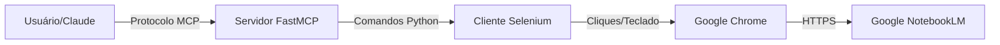

# 🩻 Anatomia do MCP NotebookLM (Análise Técnica)

**Data da Análise:** 27/01/2026
**Objeto de Estudo:** `notebooklm-mcp` (by khengyun)
**Veredito:** Automação de Navegador (RPA) mascarada de API.

## ⚙️ Mecanismo de Funcionamento

Diferente de integrações MCP tradicionais que usam APIs REST/GraphQL oficiais, este projeto utiliza uma técnica de **Browser Automation** (Automação de Navegador) para interagir com o Google NotebookLM.

### O Fluxo da "Gambiarra":
1.  **O Cliente (Você/Claude)** envia um pedido MCP (ex: "Resuma o notebook X").
2.  **O Servidor MCP (FastMCP)** recebe o pedido.
3.  **O Motor (Selenium/Undetected Chromedriver)** abre uma janela invisível (headless) ou visível do Google Chrome.
4.  **A Ação:** O script simula um usuário humano:
    *   Clica na caixa de texto.
    *   Cola a pergunta.
    *   Pressiona `ENTER`.
5.  **A Leitura:** O script monitora o HTML da página (DOM) esperando a animação de "carregando" parar e "raspa" (scrape) o texto da resposta.
6.  **O Retorno:** O texto é enviado de volta via protocolo MCP como se fosse uma resposta de API limpa.

## 🏗️ Arquitetura

## 🛠️ Funcionalidades Expostas (Tools)

O servidor transforma as ações do navegador nestas ferramentas MCP:

1.  **`chat_with_notebook`**:
    *   *Descrição*: Realiza uma interação completa (envia pergunta + espera resposta).
    *   *Uso*: Principal ferramenta para conversar com o contexto.
2.  **`send_chat_message`**:
    *   *Descrição*: Apenas envia a mensagem (útil para comandos assíncronos).
3.  **`get_chat_response`**:
    *   *Descrição*: Tenta ler a última resposta gerada na tela.
4.  **`navigate_to_notebook`**:
    *   *Descrição*: Troca o caderno ativo (mudando a URL do navegador).
5.  **`set_default_notebook`**:
    *   *Descrição*: Define qual caderno será aberto ao iniciar o servidor.

## ⚠️ Pontos Críticos

*   **Autenticação Frágil**: Depende de o usuário fazer login no Google manualmente no navegador aberto pelo script, ou de copiar perfis de usuário do Chrome.
*   **Instabilidade de UI**: Se o Google mudar o nome da classe CSS do botão de chat, o MCP para de funcionar instantaneamente.
*   **Lentidão**: A resposta demora o tempo de uma interação humana + tempo de geração da IA + tempo de leitura do HTML.

## 🧪 Conclusão
Embora funcional, é um "hack" visual. Não é um MCP "puro" de dados, mas sim um **Agente de Interface** que conecta o protocolo MCP à interface web do NotebookLM.
