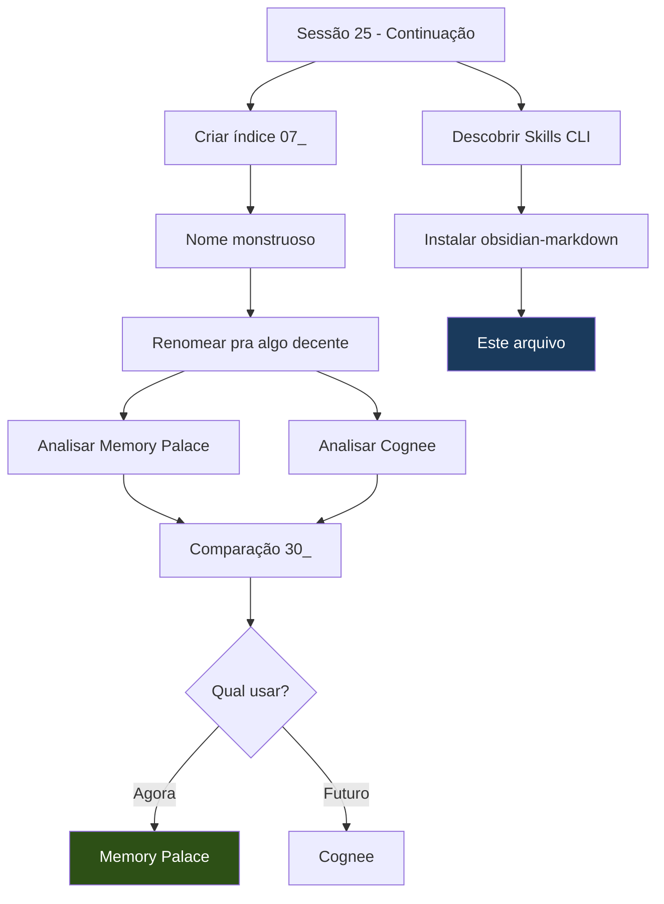

%%
Este arquivo existe para testar todas as features do Obsidian Flavored Markdown
após a instalação da skill obsidian-markdown via Skills CLI.
Não é um documento de referência — é um showcase criativo.
Se você está lendo isso no Reading View, parabéns: encontrou o easter egg.
%%

# Crônica da Sessão 25

> [!quote] cite
> "Memory doesn't belong inside the model — it belongs alongside it."
> — README do memory-palace[^1]

Essa frase resume bem o que rolou hoje. Uma sessão que começou com ==um índice de nome absurdo== e terminou com a gente questionando a própria estrutura do Lab.

---

## O Índice Rebelde

Tudo começou com uma ideia simples: catalogar ferramentas do GitHub que poderiam ser úteis pro LabCog. O nome original?

~~`07_AnalisandoFerramentasNoGitHubParaImplementarNoLabCog`~~

56 caracteres. Quase um abstract de TCC. Renomeamos pra [[07_IdeiasDeFerramentasLabCog|Ideias de Ferramentas]] e seguimos em frente. ^nome-rebelde

> [!warning] A ironia
> Criamos um índice manual depois de toda a saga dos [[16_SolucaoIndicesAtivos|Índices Ativos]]. Às vezes o pragmatismo ganha da arquitetura.

E junto com o índice, nasceu a pasta `04_Referencias/01_GitHub/` — um lugar pra eventualmente clonar repos e analisar código fonte. Estrutura nova, sem quebrar o Core.

---

## Duas Memórias, Duas Filosofias

O ponto alto da sessão: mergulhar em duas ferramentas de ==memória persistente para agentes de IA==.

### Memory Palace

[[28_MemoryPalace|Memory Palace]] é o projeto do Jeff Pierce. A proposta: separar memória de longo prazo do context window, como um cérebro real faz. #ferramenta/memoria

> [!tip] O que chamou atenção
> **Code indexing semântico** — em vez de embeddar código bruto, gera uma *descrição em prosa* do que o arquivo faz e busca sobre ela. Ninguém mais faz isso assim, exceto o Greptile (que cobra $30/dev/mês).

> [!faq]- Detalhes técnicos do ranking
> A fórmula de ranking combina três sinais:
>
> $$score = (sim_{semantica} \times 0.7) + (\log(acessos + 1) \times 0.15) + (centralidade \times 0.15)$$
>
> Onde $sim_{semantica}$ vem dos embeddings, $acessos$ é frequência de uso, e $centralidade$ é o in-degree no knowledge graph. Memórias bem conectadas e muito acessadas sobem no ranking.

### Cognee

[[29_Cognee|Cognee]] é o concorrente enterprise. Neo4j, 12k stars, paper acadêmico publicado.

> [!faq]- Pipeline de 3 estágios
> 1. **`add`** — Ingestão (30+ fontes)
> 2. **`cognify`** — LLM extrai entidades → monta grafo
> 3. **`memify`** — Algoritmos fortalecem relações semânticas

> [!note] Diferença fundamental
> > [!tip] Memory Palace
> > "Rodo em qualquer máquina com Python e Ollama. Sem cloud. Sem Docker."
>
> > [!warning] Cognee
> > "Preciso de Neo4j, Docker, e OpenAI por default. Mas ingiro 30 formatos diferentes."

A comparação completa tá em [[30_ComparacaoMemoriaPersistente|Memory Palace vs Cognee]]. Spoiler: ==Memory Palace é o melhor fit pro LabCog agora==. ^conclusao-memoria

---

## O Ecossistema de Skills

Descobrimos o **Skills CLI** — um package manager de skills pra agentes de IA.

```bash
# Como encontramos a skill do Obsidian
npx skills find obsidian
```

Resultado: 6 skills, incluindo 3 do próprio **Kepano** (criador do Obsidian). Instalamos a `obsidian-markdown`:

```bash
npx skills add kepano/obsidian-skills@obsidian-markdown -g -y
```

> [!success] Instalação
> Skill instalada em `~\.agents\skills\obsidian-markdown` com symlink pra `~\.claude\skills\`. Carrega automaticamente em toda sessão do Claude Code.

> [!danger] Trade-off
> São ==620 linhas de contexto== injetadas em **toda** sessão, relevante ou não. Mais tokens na abertura — o mesmo problema que já sabíamos que não tem solução fácil.

Referência completa: [[31_SkillsCLI|Skills CLI]]

---

## O Fluxo da Sessão



---

## Produção do Dia

| ID | Arquivo | Tipo |
| :--- | :--- | :--- |
| `28` | [[28_MemoryPalace\|Memory Palace]] | Análise |
| `29` | [[29_Cognee\|Cognee]] | Análise |
| `30` | [[30_ComparacaoMemoriaPersistente\|MP vs Cognee]] | Comparação |
| `31` | [[31_SkillsCLI\|Skills CLI]] | Referência |
| `32` | [[32_CronicaDaSessao25\|Esta crônica]] | Showcase |
| `—` | [[07_IdeiasDeFerramentasLabCog\|Índice de Ferramentas]] | Índice |

---

## O Que Ficou

- [ ] Pesquisar OpenClaw + Docker
- [ ] Testar instalação local do Memory Palace
- [ ] Avaliar se a skill obsidian-markdown vale os tokens
- [ ] Analisar os outros repos pendentes (supermemory, qmd-skill)
- [x] Criar esta crônica como showcase

---

## Reflexão Final

> [!abstract] tldr
> Começamos catalogando ferramentas e terminamos questionando se o LabCog precisa de um ==backend de memória semântica== em vez de arquivos `.md` soltos. O memory-palace faz *exatamente* o que tentamos fazer manualmente com wikilinks e frontmatter — mas com busca por significado, knowledge graph automático, e extração de memórias de transcrições.
>
> A pergunta que fica: até onde vamos com a abordagem artesanal antes de plugar algo assim? ^reflexao-final

<details>
<summary>Atalhos úteis descobertos hoje</summary>

| Ação | Comando |
| :--- | :--- |
| Buscar skills | <kbd>npx</kbd> <kbd>skills</kbd> <kbd>find</kbd> `[query]` |
| Instalar skill | <kbd>npx</kbd> <kbd>skills</kbd> <kbd>add</kbd> `<repo@skill>` `-g` `-y` |
| Ver skills instaladas | Checar `~\.claude\skills\` |

</details>

[^1]: [jeffpierce/memory-palace](https://github.com/jeffpierce/memory-palace) — Persistent semantic memory for AI agents.
[^2]: [topoteretes/cognee](https://github.com/topoteretes/cognee) — Memory for AI Agents in 6 lines of code.
